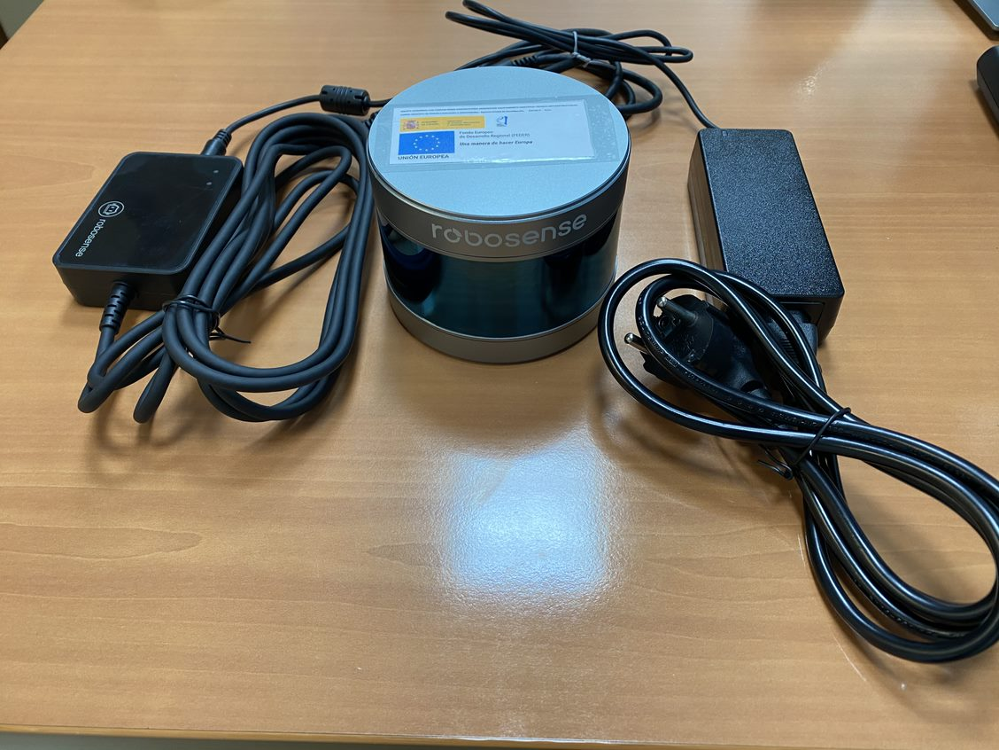
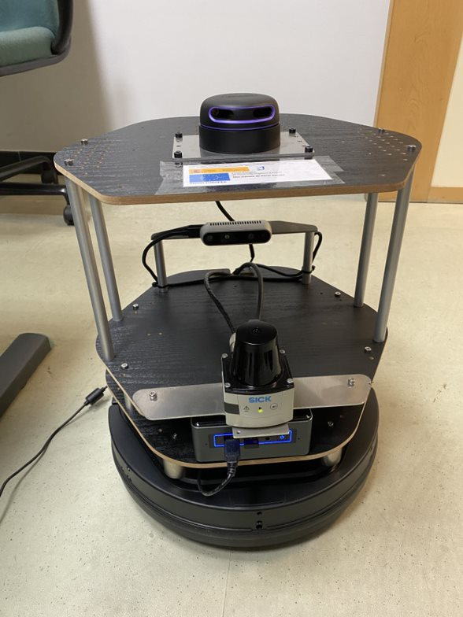

Entre las diversas líneas de investigación en Ingeniería Informática que apoya el [Instituto Universitario de Investigación en Ingeniería Informática de la Universidad de Sevilla](https://i3us.us.es/) (I3US), cabe destacar aquellas relacionadas con la Robótica, la Inteligencia Artificial y la Automatización. Con el fin de fomentar y apoyar la investigación en estas líneas, el I3US dispone de material e infraestructuras de robótica que pone al servicio de sus investigadores. Asimismo, la [siguiente página en Github](https://github.com/robotics-i3us) contiene repositorios de software libre creados y mantenidos por miembros del I3US para promover la colaboración y facilitar el uso compartido del material.

En esta página se detalla el material disponible.

- [RS-Lidar-16](#rs-lidar-16)
- [Plataforma TurtleBot II](#plataforma-turtlebot-ii)
  * [Base Kobuki](#base-kobuki)
  * [Lidar 2D TIM551-205001](#lidar-2d-tim551-205001)
  * [Lidar 2D RPLIDAR A3](#lidar-2d-rplidar-a3)
  * [Intel RealSense Depth Camera D435](#intel-realsense-depth-camera-d435)
  * [CPU NUC i7](#cpu-nuc-i7)
- [Plataforma XL-GEN](#plataforma-xl-gen)

Dicho material ha sido adquirido con fondos FEDER Convocatoria Adquisición Equipamiento Científico-Técnico Infraestructuras: FEDER / Ministerio de Ciencia e Innovación y Universidades - Agencia Estatal de Investigación EQC2019 - 6325.

## RS-Lidar-16

Sensor LiDAR con campo de visión de 360 grados (horizontal) y 30 grados (vertical), 150 metros de alcance y precisión de 2cm. Las aplicaciones principales del RS-LiDAR-16 son la conducción autónoma, la percepción del entorno de robots y el mapeo de UAV.

* [Página web del producto](https://www.roscomponents.com/es/lidar-escaner-laser/251-rs-lidar-16.html)
* [Paquete oficial para ROS](https://github.com/RoboSense-LiDAR/rslidar_sdk)  

## Plataforma TurtleBot II

### Base Kobuki

### Lidar 2D TIM551-205001

### Lidar 2D RPLIDAR A3

### Intel RealSense Depth Camera D435

### CPU NUC i7 

## Plataforma XL-GEN

